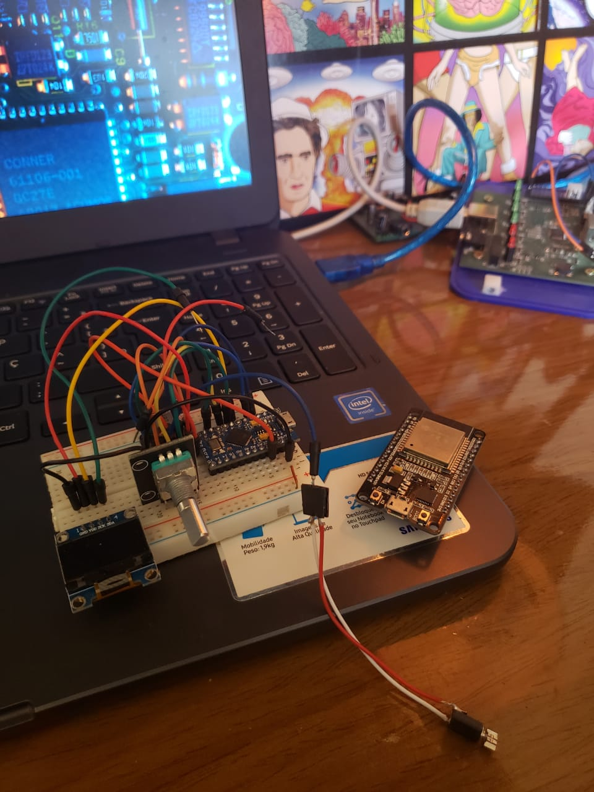

# Vitron
This an arduino project consists on create an wearable and haptic arduino metronome similar to SoundBrenner device, but with low cost and  3D printer materials.

# Bill of materials:
- Arduino Pro micro
- OLED Display
- Encoder
- Vibrating motor
- Battery
- Transistors, leds and resistors.

 

