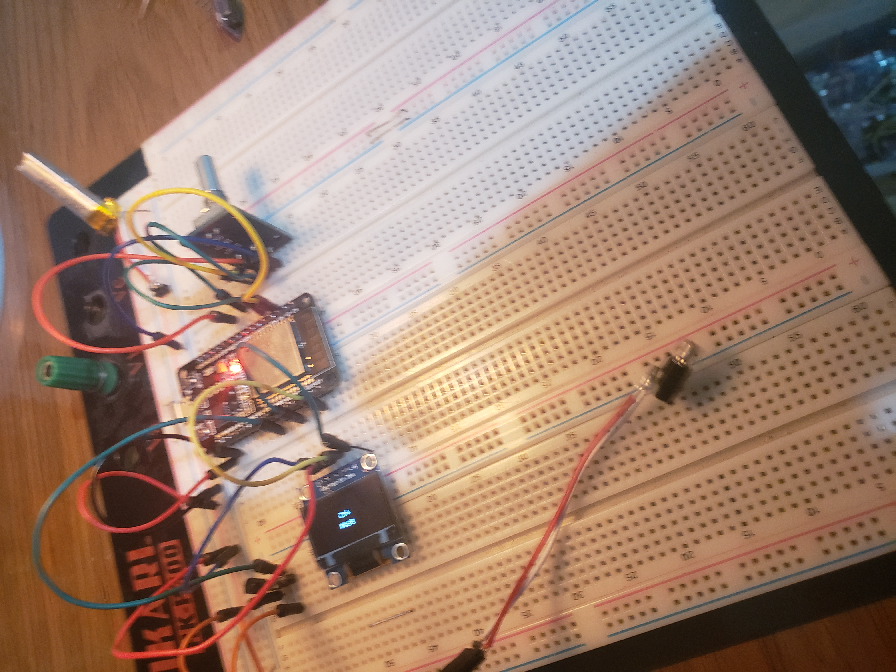
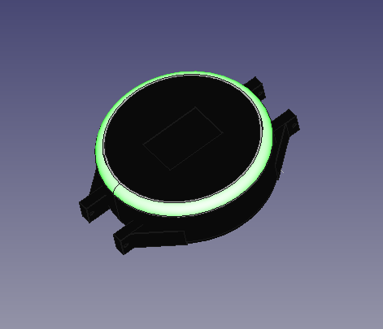

**WORK IN PROGRESS**

# (V)ibratrions (P)er (M)inute 
This ESP32 project consists on create a wearable and haptic metronome similar to SoundBrenner device, but with low cost and  3D printer materials.
# Current state of the project:
 

 
# 3D case design:
 

# Bill of materials:
- ESP32
- OLED Display
- Encoder
- Vibrating motor
- Battery
- Transistors, leds and resistors.

